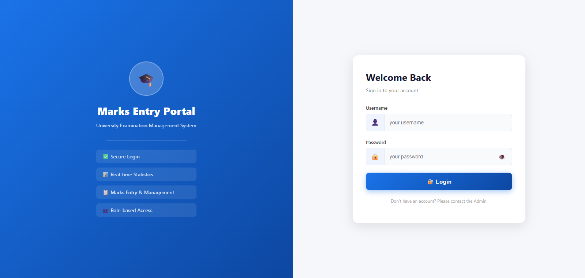
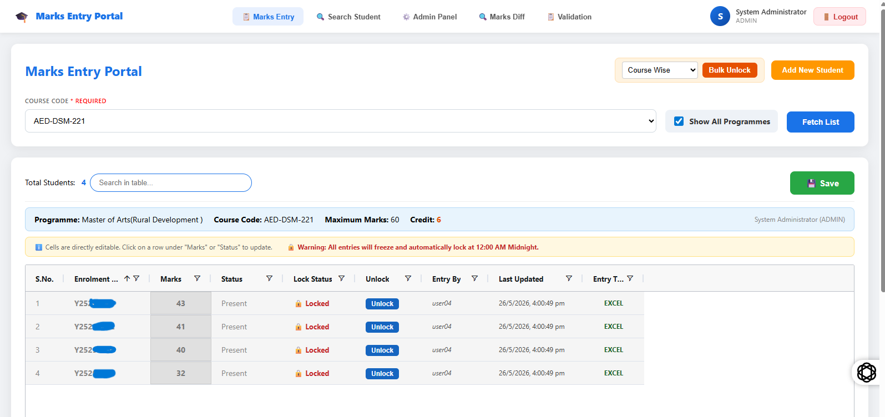
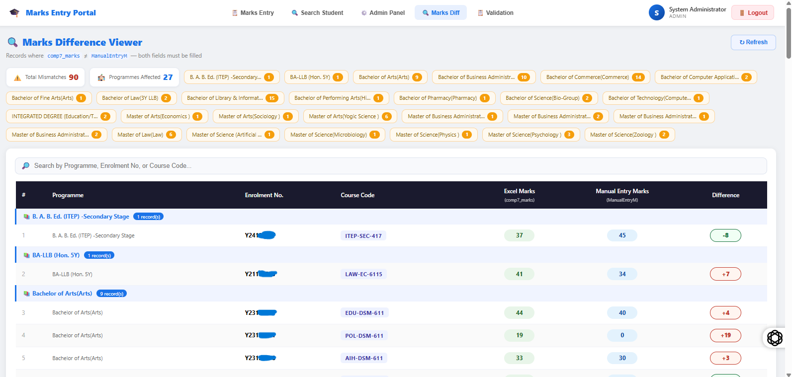
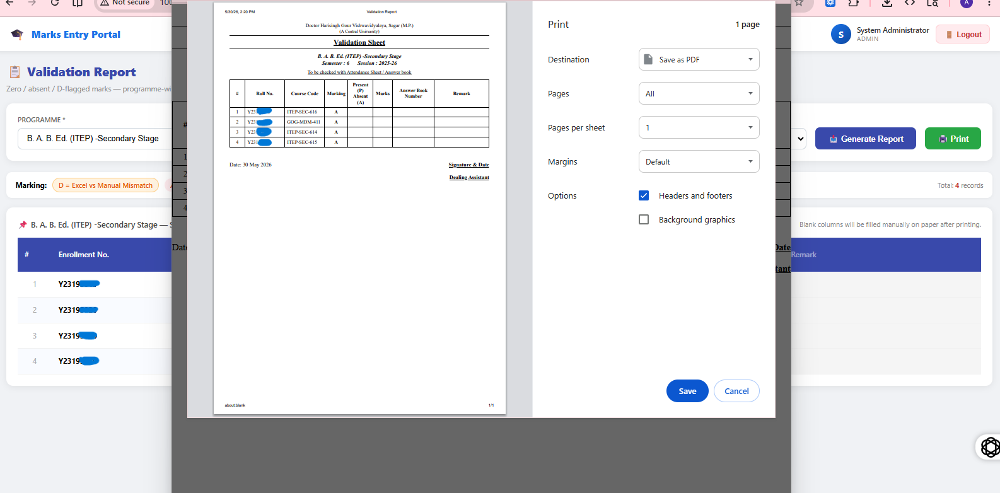
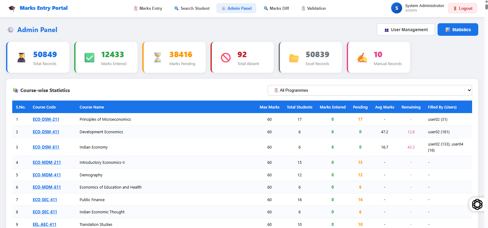
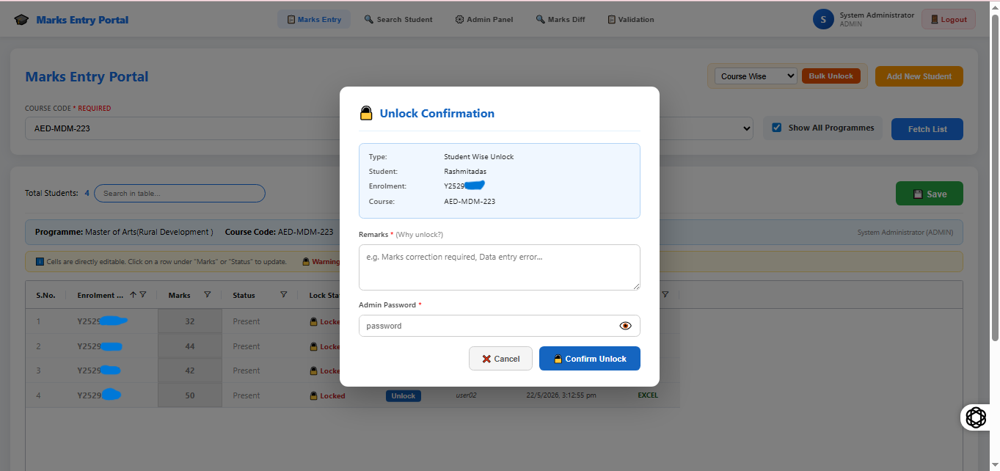

# 📋 University Marks Entry Portal

> A production-ready University Marks Entry System with JWT Authentication,
> Role-based Access Control, Lock/Unlock system, Marks Diff Viewer,
> Printable Validation Reports, and more.
> Deployed on University Intranet Server.

---

## 🖥️ Live Demo

> Deployed on University Intranet Server
> Accessible via University WiFi only

---

## ✨ Features

| Feature | Description |
|---------|-------------|
| 🔐 JWT Login | Secure authentication with 8hr (Working hour) token expiry |
| 👥 Role Access | Admin / Examiner / Viewer roles |
| 📝 Marks Entry | Float marks support (28.5, 47.75) with 0 to MaxMarks validation |
| 🔒 Auto Lock System Marks locked 1 day Complete | Admin manually locks records after verification |
| 🔓 Unlock System | Password + Remarks required to unlock (full audit trail) |
| 🔍 Marks Diff | Excel (Samarth Portal) vs Manual entry comparison viewer |
| 📋 Validation Report | Printable A4 sheet — university format with D/A/W/UFM flags |
| 🔎 Search Student | Full marks history by enrolment number |
| 📊 Statistics | Programme-wise filter, course stats, entry tracking |
| 👤 Entry Tracking | Who entered, when, manual or excel |
| ⚙️ Admin Panel | User management, bulk unlock (student/course/programme wise) |

---

## 🛠️ Tech Stack

### Backend
- Java 21
- Spring Boot
- Spring Security + JWT
- MySQL 8
- Maven
- Lombok
- Apache POI (Excel)

### Frontend
- React 19 + Vite
- AG Grid v35
- Axios
- React Toastify
- React Router DOM v7

### Server
- Windows Server (Virtual Machine)
- Nginx (Reverse Proxy)
- Git

---

## 🏗️ Architecture

```
University WiFi
      ↓
Windows Server (100.66.x.x)
      ↓
Nginx (Port 80)
   ↓              ↓
React           /api → Spring Boot (8080)
(dist/)                      ↓
                        MySQL (3306)
                  marks_entry_db + temp123
```

---

## 📁 Project Structure

```
backend/
├── src/main/java/com/marksentry/backend/
│   ├── controller/
│   │   ├── AuthController.java
│   │   ├── DataMasterController.java
│   │   ├── LockController.java
│   │   ├── MarksController.java
│   │   ├── MarksDiffController.java
│   │   ├── StatisticsController.java
│   │   └── ValidationReportController.java
│   ├── service/
│   │   ├── AuthService.java
│   │   ├── LockService.java
│   │   └── MarksService.java
│   ├── repository/
│   │   ├── DataMasterRepository.java
│   │   ├── MarksRepository.java
│   │   ├── TempRawExcelRepository.java
│   │   └── UserRepository.java
│   ├── entity/
│   │   ├── DataMaster.java
│   │   ├── Marks.java
│   │   ├── TempRawExcel.java
│   │   └── User.java
│   ├── security/
│   │   ├── JwtFilter.java
│   │   ├── JwtUtil.java
│   │   └── SecurityConfig.java
│   └── dto/
│       ├── LoginRequest.java
│       └── LoginResponse.java
└── src/main/resources/
    └── application.properties

frontend/
└── src/
    ├── pages/
    │   ├── LoginPage.jsx
    │   ├── AdminPanel.jsx
    │   ├── MarksDiffPage.jsx
    │   ├── ValidationReportPage.jsx
    │   └── SearchStudent.jsx
    ├── components/
    │   ├── Navbar.jsx
    │   └── UnlockModal.jsx
    ├── App.jsx
    └── api.js
```

---

## 🚀 Setup — Local Development

### Prerequisites
```
Java 21+
Node.js 18+
MySQL 8+
Maven 3.9+
```

### Backend
```bash
cd backend
# Update application.properties with your DB credentials
mvn spring-boot:run
```

### Frontend
```bash
cd frontend
npm install
npm run dev
```

### Database
```sql
CREATE DATABASE marks_entry_db CHARACTER SET utf8mb4;
-- Run complete_schema.sql
```

---

## 🔑 Default Login

```
Username : admin
Password : admin123
Role     : ADMIN
```

---

## 📸 Screenshots

<p align="center">
  
  <br>
  <i>1. Secure Login Interface supporting Role-Based Authentication (Admin/Examiner/Viewer).</i>
</p>

---

<p align="center">
  
  <br>
  <i>2. Interactive Marks Entry Dashboard powered by AG-Grid with real-time range validations.</i>
</p>

---

<p align="center">
  
  <br>
  <i>3. Marks Diff Viewer: Intelligent comparison tool matching Samarth Portal Excel data against Manual entries.</i>
</p>

---

<p align="center">
  
  <br>
  <i>4. University Format Validation Report (Printable A4 layout with D/A/W/UFM flags).</i>
</p>

---

<p align="center">
  
  <br>
  <i>5. Comprehensive Admin Control Panel featuring data visualization, entry tracking</i>
</p>

---

<p align="center">
  
  <br>
  <i>6. Comprehensive Admin Control Panel featuring data  bulk lock/unlock audit logs.</i>
</p>

---

## 🎯 API Endpoints

| Method | Endpoint | Description |
|--------|----------|-------------|
| POST | /api/auth/login | Login |
| GET | /api/auth/me | Current user info |
| GET | /api/search | Search marks |
| POST | /api/save | Save marks (batch) |
| POST | /api/add-new | Add manual record |
| PUT | /api/lock/unlock/single | Unlock single record |
| PUT | /api/lock/unlock/course | Bulk unlock by course |
| PUT | /api/lock/unlock/programme | Bulk unlock by programme |
| GET | /api/lock/summary | Lock summary |
| GET | /api/admin/users | Get all users |
| POST | /api/admin/users | Create user |
| PUT | /api/admin/users/{id} | Update user |
| PUT | /api/admin/users/{id}/toggle | Enable / Disable user |
| GET | /api/admin/stats/overview | Statistics overview |
| GET | /api/admin/stats/per-course-filtered | Course-wise stats |
| GET | /api/admin/stats/entry-source | MANUAL vs EXCEL count |
| GET | /api/admin/stats/entry-by-user | Entry breakdown by user |
| GET | /api/admin/marks-diff | Excel vs Manual diff |
| GET | /api/admin/validation-report | Validation report data |
| GET | /api/programmes | Programme dropdown |
| GET | /api/terms | Term dropdown |
| GET | /api/coursecodes | Course code dropdown |
| GET | /api/all-coursecodes | All course codes |

---

## 🔐 Role Permissions

| Feature | ADMIN | EXAMINER | VIEWER |
|---------|-------|----------|--------|
| Marks Entry | ✅ All records | ✅ Own entries only | ❌ |
| Lock / Unlock | ✅ | ❌ | ❌ |
| Statistics | ✅ | ✅ | ✅ |
| Marks Diff | ✅ | ✅ | ✅ |
| Validation Report | ✅ | ✅ | ✅ |
| Search Student | ✅ | ✅ | ✅ |
| User Management | ✅ | ❌ | ❌ |

---

## 📅 Built In

14 days — Week 1: Core system built and deployed.
Week 2: Iterated on real user feedback.

---

## 🎯 Next Target

- Affiliated Colleges feature
- College Admin role (own college data only)
- University Admin role (all colleges)
- Excel import feature
- Password reset functionality

---

## 👨‍💻 Author

**Akash Chaurasiya**
Site Technical Engineer → Full Stack Developer

[](https://www.linkedin.com/in/akash0772/)
[](https://github.com/Akash0772)

---


© 2026 Akash Chaurasiya. All rights reserved.
